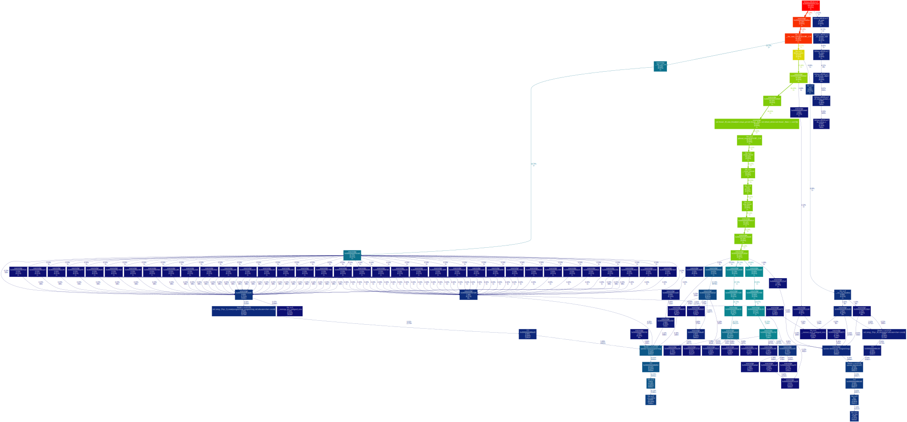

# Report
I have chosen a simple CPP program that recursively calculates the 'n'th fibonacci number and compiled it to a wasm file using `emscripten`. Then I used the callgrind tool from valgrind to profile the execution of this program with `wasmedge`. To convert the resulting data to a graph I have used the `gprof2dot` python utility.

## Files
[CPP Source](./fib.cpp)

[Compiled wasm file](./fib.wasm)

[Call Graph](./fib.svg)

## Output of the `callgrind_annotate`:
Below you can see the output generated by running `callgrind_annotate` the generated callgrind profile.

```bash
--------------------------------------------------------------------------------
Profile data file 'callgrind.out.6493' (creator: callgrind-3.18.1)
--------------------------------------------------------------------------------
I1 cache: 
D1 cache: 
LL cache: 
Timerange: Basic block 0 - 15108482
Trigger: Program termination
Profiled target:  wasmedge fib.wasm (PID 6493, part 1)
Events recorded:  Ir
Events shown:     Ir
Event sort order: Ir
Thresholds:       99
Include dirs:     
User annotated:   
Auto-annotation:  on

--------------------------------------------------------------------------------
Ir                  
--------------------------------------------------------------------------------
76,307,804 (100.0%)  PROGRAM TOTALS

--------------------------------------------------------------------------------
Ir                   file:function
--------------------------------------------------------------------------------
10,393,469 (13.62%)  ???:0x000000000054e0c0 [/home/user/.wasmedge/bin/wasmedge]
 7,755,696 (10.16%)  /usr/src/debug/glibc-2.34-25.fc35.x86_64/malloc/malloc.c:_int_malloc [/usr/lib64/libc.so.6]                 # Note the function
 7,579,491 ( 9.93%)  ???:0x000000000053e7b0 [/home/user/.wasmedge/bin/wasmedge]                                                  
 5,529,233 ( 7.25%)  /usr/src/debug/glibc-2.34-25.fc35.x86_64/malloc/malloc.c:_int_free [/usr/lib64/libc.so.6]                   # Note the function
 4,346,550 ( 5.70%)  ???:0x000000000053ce00 [/home/user/.wasmedge/bin/wasmedge]
 3,662,398 ( 4.80%)  ???:0x0000000000542510 [/home/user/.wasmedge/bin/wasmedge]
 3,140,452 ( 4.12%)  ???:0x000000000055dc50 [/home/user/.wasmedge/bin/wasmedge]
 2,897,489 ( 3.80%)  /usr/src/debug/glibc-2.34-25.fc35.x86_64/malloc/malloc.c:malloc [/usr/lib64/libc.so.6]
 2,560,239 ( 3.36%)  ???:0x000000000054ba40 [/home/user/.wasmedge/bin/wasmedge]
 2,073,021 ( 2.72%)  ???:0x000000000054a290 [/home/user/.wasmedge/bin/wasmedge]
 1,573,769 ( 2.06%)  /usr/src/debug/glibc-2.34-25.fc35.x86_64/malloc/malloc.c:free [/usr/lib64/libc.so.6]
 1,569,532 ( 2.06%)  ???:0x00000000005760c0 [/home/user/.wasmedge/bin/wasmedge]
 1,554,092 ( 2.04%)  ???:0x000000000053cd90 [/home/user/.wasmedge/bin/wasmedge]
 1,463,072 ( 1.92%)  /usr/src/debug/glibc-2.34-25.fc35.x86_64/elf/dl-lookup.c:_dl_lookup_symbol_x [/usr/lib64/ld-linux-x86-64.so.2]
 1,288,273 ( 1.69%)  ???:0x00000000005de3b0 [/home/user/.wasmedge/bin/wasmedge]
 1,181,538 ( 1.55%)  /usr/src/debug/glibc-2.34-25.fc35.x86_64/elf/dl-lookup.c:do_lookup_x [/usr/lib64/ld-linux-x86-64.so.2]
 1,055,196 ( 1.38%)  ???:0x00000000005dd470 [/home/user/.wasmedge/bin/wasmedge]
 1,031,580 ( 1.35%)  ???:0x0000000000510ef0 [/home/user/.wasmedge/bin/wasmedge]
   975,272 ( 1.28%)  ???:0x000000000053a0a0 [/home/user/.wasmedge/bin/wasmedge]
   769,515 ( 1.01%)  ???:0x0000000000545620 [/home/user/.wasmedge/bin/wasmedge]
   743,004 ( 0.97%)  ???:0x0000000000507280 [/home/user/.wasmedge/bin/wasmedge]
   731,196 ( 0.96%)  /usr/src/debug/gcc-11.2.1-7.fc35.x86_64/obj-x86_64-redhat-linux/x86_64-redhat-linux/libstdc++-v3/libsupc++/../../../../libstdc++-v3/libsupc++/new_op.cc:operator new(unsigned long) [/usr/lib64/libstdc++.so.6.0.29]
   672,635 ( 0.88%)  ???:0x000000000055e0e0 [/home/user/.wasmedge/bin/wasmedge]
   604,054 ( 0.79%)  ???:0x00000000005121e0 [/home/user/.wasmedge/bin/wasmedge]
   594,255 ( 0.78%)  ???:0x000000000050d670 [/home/user/.wasmedge/bin/wasmedge]
   480,069 ( 0.63%)  ???:0x0000000000561780 [/home/user/.wasmedge/bin/wasmedge]
   469,762 ( 0.62%)  /usr/src/debug/glibc-2.34-25.fc35.x86_64/string/../sysdeps/x86_64/multiarch/memset-vec-unaligned-erms.S:__memset_avx2_unaligned_erms [/usr/lib64/libc.so.6]
   466,500 ( 0.61%)  ???:0x000000000053cb30 [/home/user/.wasmedge/bin/wasmedge]
   435,036 ( 0.57%)  ???:0x0000000000575710 [/home/user/.wasmedge/bin/wasmedge]
   431,903 ( 0.57%)  ???:0x000000000053a370 [/home/user/.wasmedge/bin/wasmedge]
   421,353 ( 0.55%)  /usr/src/debug/glibc-2.34-25.fc35.x86_64/string/../sysdeps/x86_64/multiarch/memmove-vec-unaligned-erms.S:__memcpy_avx_unaligned_erms [/usr/lib64/libc.so.6]
   369,558 ( 0.48%)  /usr/src/debug/gcc-11.2.1-7.fc35.x86_64/obj-x86_64-redhat-linux/x86_64-redhat-linux/libstdc++-v3/include/bits/basic_string.tcc:std::string::_Rep::_S_create(unsigned long, unsigned long, std::allocator<char> const&) [/usr/lib64/libstdc++.so.6.0.29]
   348,195 ( 0.46%)  /usr/src/debug/glibc-2.34-25.fc35.x86_64/elf/../sysdeps/x86_64/dl-machine.h:_dl_relocate_object
   322,448 ( 0.42%)  ???:0x0000000000541b10 [/home/user/.wasmedge/bin/wasmedge]
   305,490 ( 0.40%)  /usr/src/debug/glibc-2.34-25.fc35.x86_64/string/../sysdeps/x86_64/multiarch/strlen-avx2.S:__strlen_avx2 [/usr/lib64/libc.so.6]
   300,204 ( 0.39%)  ???:0x0000000000513e30 [/home/user/.wasmedge/bin/wasmedge]
   295,013 ( 0.39%)  ???:0x000000000054b430 [/home/user/.wasmedge/bin/wasmedge]
   270,864 ( 0.35%)  ???:0x000000000054ab90 [/home/user/.wasmedge/bin/wasmedge]
   245,432 ( 0.32%)  ???:0x00000000005ddd30 [/home/user/.wasmedge/bin/wasmedge]
   218,418 ( 0.29%)  /usr/src/debug/gcc-11.2.1-7.fc35.x86_64/obj-x86_64-redhat-linux/x86_64-redhat-linux/libstdc++-v3/src/c++11/../../../../../libstdc++-v3/src/c++11/hashtable_c++0x.cc:std::__detail::_Prime_rehash_policy::_M_need_rehash(unsigned long, unsigned long, unsigned long) const [/usr/lib64/libstdc++.so.6.0.29]
   202,772 ( 0.27%)  /usr/src/debug/glibc-2.34-25.fc35.x86_64/malloc/malloc.c:alloc_perturb [/usr/lib64/libc.so.6]
   198,524 ( 0.26%)  ???:0x0000000000575290 [/home/user/.wasmedge/bin/wasmedge]
   195,772 ( 0.26%)  ???:0x000000000053cca0 [/home/user/.wasmedge/bin/wasmedge]
   189,872 ( 0.25%)  /usr/src/debug/glibc-2.34-25.fc35.x86_64/string/../sysdeps/x86_64/strcmp.S:strcmp [/usr/lib64/ld-linux-x86-64.so.2]
   187,827 ( 0.25%)  /usr/src/debug/glibc-2.34-25.fc35.x86_64/elf/dl-lookup.c:check_match [/usr/lib64/ld-linux-x86-64.so.2]
   181,248 ( 0.24%)  ???:0x00000000005e0b30 [/home/user/.wasmedge/bin/wasmedge]
   149,864 ( 0.20%)  ???:0x0000000000506740 [/home/user/.wasmedge/bin/wasmedge]
   131,858 ( 0.17%)  ???:0x0000000000517390 [/home/user/.wasmedge/bin/wasmedge]
   123,184 ( 0.16%)  ???:0x000000000054e030 [/home/user/.wasmedge/bin/wasmedge]
   121,868 ( 0.16%)  ???:0x00000000048fdf50 [???]
   121,854 ( 0.16%)  /usr/src/debug/gcc-11.2.1-7.fc35.x86_64/obj-x86_64-redhat-linux/x86_64-redhat-linux/libstdc++-v3/libsupc++/../../../../libstdc++-v3/libsupc++/del_op.cc:operator delete(void*) [/usr/lib64/libstdc++.so.6.0.29]
   121,854 ( 0.16%)  ???:0x00000000048fe9d0 [???]
   116,944 ( 0.15%)  ???:operator delete(void*, unsigned long) [/home/user/.wasmedge/bin/wasmedge]
   115,620 ( 0.15%)  /usr/src/debug/glibc-2.34-25.fc35.x86_64/elf/do-rel.h:_dl_relocate_object
   110,411 ( 0.14%)  ???:0x00000000005e3f50 [/home/user/.wasmedge/bin/wasmedge]
   103,727 ( 0.14%)  ???:0x0000000000531c50 [/home/user/.wasmedge/bin/wasmedge]
   103,218 ( 0.14%)  ???:0x000000000057cb30 [/home/user/.wasmedge/bin/wasmedge]
   101,933 ( 0.13%)  ???:0x000000000052a7a0 [/home/user/.wasmedge/bin/wasmedge]
    92,982 ( 0.12%)  /usr/src/debug/glibc-2.34-25.fc35.x86_64/malloc/malloc.c:unlink_chunk.constprop.0 [/usr/lib64/libc.so.6]
    86,953 ( 0.11%)  /usr/src/debug/gcc-11.2.1-7.fc35.x86_64/obj-x86_64-redhat-linux/x86_64-redhat-linux/libstdc++-v3/include/ext/new_allocator.h:std::string::_Rep::_S_create(unsigned long, unsigned long, std::allocator<char> const&)
    83,400 ( 0.11%)  ???:0x000000000054ab40 [/home/user/.wasmedge/bin/wasmedge]
    80,364 ( 0.11%)  /usr/src/debug/glibc-2.34-25.fc35.x86_64/malloc/malloc.c:malloc_consolidate [/usr/lib64/libc.so.6]
    65,901 ( 0.09%)  /usr/src/debug/glibc-2.34-25.fc35.x86_64/malloc/malloc.c:sysmalloc [/usr/lib64/libc.so.6]
    65,550 ( 0.09%)  ???:0x00000000005e13a0 [/home/user/.wasmedge/bin/wasmedge]
    64,284 ( 0.08%)  ???:0x0000000000513bb0 [/home/user/.wasmedge/bin/wasmedge]
    60,886 ( 0.08%)  ???:0x00000000005e1050 [/home/user/.wasmedge/bin/wasmedge]
    58,220 ( 0.08%)  ???:0x00000000005dd630 [/home/user/.wasmedge/bin/wasmedge]
    57,287 ( 0.08%)  ???:0x000000000053fd10 [/home/user/.wasmedge/bin/wasmedge]
    50,611 ( 0.07%)  ???:0x0000000000510eb0 [/home/user/.wasmedge/bin/wasmedge]
    43,906 ( 0.06%)  ???:0x00000000048fda30 [???]
    43,894 ( 0.06%)  ???:0x00000000048fe160 [???]
    43,833 ( 0.06%)  ???:0x00000000005c6a00 [/home/user/.wasmedge/bin/wasmedge]
    43,176 ( 0.06%)  /usr/src/debug/gcc-11.2.1-7.fc35.x86_64/obj-x86_64-redhat-linux/x86_64-redhat-linux/libstdc++-v3/include/bits/move.h:std::__detail::_Prime_rehash_policy::_M_need_rehash(unsigned long, unsigned long, unsigned long) const
    42,344 ( 0.06%)  ???:0x00000000005070e0 [/home/user/.wasmedge/bin/wasmedge]
    39,627 ( 0.05%)  ???:0x00000000005c1570 [/home/user/.wasmedge/bin/wasmedge]
    38,488 ( 0.05%)  ???:0x00000000005068e0 [/home/user/.wasmedge/bin/wasmedge]
    35,672 ( 0.05%)  ???:0x0000000000511140 [/home/user/.wasmedge/bin/wasmedge]
    35,312 ( 0.05%)  /usr/src/debug/gcc-11.2.1-7.fc35.x86_64/obj-x86_64-redhat-linux/x86_64-redhat-linux/libstdc++-v3/src/c++11/../../../../../libstdc++-v3/src/c++11/hashtable_c++0x.cc:std::__detail::_Prime_rehash_policy::_M_next_bkt(unsigned long) const [/usr/lib64/libstdc++.so.6.0.29]
    31,973 ( 0.04%)  ???:0x000000000053ff10 [/home/user/.wasmedge/bin/wasmedge]
    31,055 ( 0.04%)  ???:0x00000000005e09a0 [/home/user/.wasmedge/bin/wasmedge]
    29,522 ( 0.04%)  /usr/src/debug/glibc-2.34-25.fc35.x86_64/elf/dl-tunables.c:__GI___tunables_init [/usr/lib64/ld-linux-x86-64.so.2]
    27,712 ( 0.04%)  /usr/src/debug/glibc-2.34-25.fc35.x86_64/string/../sysdeps/x86_64/multiarch/memcmp-avx2-movbe.S:__memcmp_avx2_movbe [/usr/lib64/libc.so.6]
    24,754 ( 0.03%)  /usr/src/debug/gcc-11.2.1-7.fc35.x86_64/obj-x86_64-redhat-linux/x86_64-redhat-linux/libstdc++-v3/include/bits/stl_algobase.h:std::__detail::_Prime_rehash_policy::_M_next_bkt(unsigned long) const
    22,498 ( 0.03%)  /usr/src/debug/glibc-2.34-25.fc35.x86_64/malloc/arena.c:sysmalloc
    21,739 ( 0.03%)  /usr/src/debug/gcc-11.2.1-7.fc35.x86_64/obj-x86_64-redhat-linux/x86_64-redhat-linux/libstdc++-v3/include/bits/basic_string.h:std::string::_Rep::_S_create(unsigned long, unsigned long, std::allocator<char> const&)
    21,739 ( 0.03%)  /usr/src/debug/gcc-11.2.1-7.fc35.x86_64/obj-x86_64-redhat-linux/x86_64-redhat-linux/libstdc++-v3/include/bits/basic_string.tcc:std::string::_Rep::_M_destroy(std::allocator<char> const&) [/usr/lib64/libstdc++.so.6.0.29]
    21,739 ( 0.03%)  /usr/src/debug/gcc-11.2.1-7.fc35.x86_64/obj-x86_64-redhat-linux/x86_64-redhat-linux/libstdc++-v3/include/ext/new_allocator.h:std::string::_Rep::_M_destroy(std::allocator<char> const&)
    19,764 ( 0.03%)  ???:0x0000000000513cf0 [/home/user/.wasmedge/bin/wasmedge]
    17,272 ( 0.02%)  ???:0x00000000005dd0f0 [/home/user/.wasmedge/bin/wasmedge]
    17,272 ( 0.02%)  ???:0x00000000005dd2b0 [/home/user/.wasmedge/bin/wasmedge]
    17,170 ( 0.02%)  ???:0x000000000057db50 [/home/user/.wasmedge/bin/wasmedge]
    16,800 ( 0.02%)  /usr/src/debug/glibc-2.34-25.fc35.x86_64/stdlib/cxa_atexit.c:__internal_atexit [/usr/lib64/libc.so.6]
    16,239 ( 0.02%)  /usr/src/debug/glibc-2.34-25.fc35.x86_64/elf/dl-version.c:_dl_check_map_versions [/usr/lib64/ld-linux-x86-64.so.2]
    15,579 ( 0.02%)  ???:0x00000000005e1210 [/home/user/.wasmedge/bin/wasmedge]
    15,542 ( 0.02%)  ???:0x000000000052e7c0 [/home/user/.wasmedge/bin/wasmedge]
    15,470 ( 0.02%)  ???:0x00000000005077a0 [/home/user/.wasmedge/bin/wasmedge]
    15,470 ( 0.02%)  ???:0x0000000000507940 [/home/user/.wasmedge/bin/wasmedge]
    15,233 ( 0.02%)  /usr/src/debug/glibc-2.34-25.fc35.x86_64/stdlib/cxa_atexit.c:__new_exitfn [/usr/lib64/libc.so.6]
    15,048 ( 0.02%)  /usr/src/debug/glibc-2.34-25.fc35.x86_64/elf/../sysdeps/generic/ldsodefs.h:_dl_relocate_object
    14,689 ( 0.02%)  ???:0x0000000000506c00 [/home/user/.wasmedge/bin/wasmedge]
    14,578 ( 0.02%)  ???:0x00000000005ddb70 [/home/user/.wasmedge/bin/wasmedge]
    14,559 ( 0.02%)  ???:0x0000000000533230 [/home/user/.wasmedge/bin/wasmedge]
    14,373 ( 0.02%)  ???:0x000000000057ee10 [/home/user/.wasmedge/bin/wasmedge]
    13,878 ( 0.02%)  ???:0x000000000054b2a0 [/home/user/.wasmedge/bin/wasmedge]
    12,925 ( 0.02%)  ???:0x0000000000586c90 [/home/user/.wasmedge/bin/wasmedge]
    12,390 ( 0.02%)  ???:0x00000000005bf240 [/home/user/.wasmedge/bin/wasmedge]
    12,284 ( 0.02%)  /usr/src/debug/glibc-2.34-25.fc35.x86_64/stdlib/exit.c:__run_exit_handlers [/usr/lib64/libc.so.6]
    12,000 ( 0.02%)  /usr/src/debug/gcc-11.2.1-7.fc35.x86_64/obj-x86_64-redhat-linux/x86_64-redhat-linux/libstdc++-v3/src/c++98/../../../../../libstdc++-v3/src/c++98/locale.cc:std::locale::_Impl::_M_install_facet(std::locale::id const*, std::locale::facet const*) [/usr/lib64/libstdc++.so.6.0.29]
    11,792 ( 0.02%)  ???:0x00000000005ddef0 [/home/user/.wasmedge/bin/wasmedge]
    11,212 ( 0.01%)  ???:0x00000000005e1620 [/home/user/.wasmedge/bin/wasmedge]
    10,921 ( 0.01%)  ???:0x0000000000562480 [/home/user/.wasmedge/bin/wasmedge]
    10,780 ( 0.01%)  ???:0x00000000005065a0 [/home/user/.wasmedge/bin/wasmedge]
    10,749 ( 0.01%)  ???:0x00000000005362b0 [/home/user/.wasmedge/bin/wasmedge]
    10,137 ( 0.01%)  /usr/src/debug/glibc-2.34-25.fc35.x86_64/elf/../sysdeps/generic/ldsodefs.h:do_lookup_x
     9,158 ( 0.01%)  ???:0x000000000053f5d0 [/home/user/.wasmedge/bin/wasmedge]
     9,078 ( 0.01%)  ???:0x000000000050cfa0 [/home/user/.wasmedge/bin/wasmedge]
     9,022 ( 0.01%)  ???:0x0000000000448a30 [/home/user/.wasmedge/bin/wasmedge]
     9,019 ( 0.01%)  ???:0x0000000000501110 [/home/user/.wasmedge/bin/wasmedge]
     9,018 ( 0.01%)  ???:0x000000000044f410 [/home/user/.wasmedge/bin/wasmedge]
     9,018 ( 0.01%)  ???:0x00000000004548c0 [/home/user/.wasmedge/bin/wasmedge]
     9,018 ( 0.01%)  ???:0x000000000045b2c0 [/home/user/.wasmedge/bin/wasmedge]
     9,018 ( 0.01%)  ???:0x0000000000467be0 [/home/user/.wasmedge/bin/wasmedge]
     9,018 ( 0.01%)  ???:0x000000000046d090 [/home/user/.wasmedge/bin/wasmedge]
     9,018 ( 0.01%)  ???:0x0000000000472540 [/home/user/.wasmedge/bin/wasmedge]
     9,018 ( 0.01%)  ???:0x00000000004779f0 [/home/user/.wasmedge/bin/wasmedge]

--------------------------------------------------------------------------------
The following files chosen for auto-annotation could not be found:
--------------------------------------------------------------------------------
  /usr/src/debug/gcc-11.2.1-7.fc35.x86_64/obj-x86_64-redhat-linux/x86_64-redhat-linux/libstdc++-v3/include/bits/basic_string.h
  /usr/src/debug/gcc-11.2.1-7.fc35.x86_64/obj-x86_64-redhat-linux/x86_64-redhat-linux/libstdc++-v3/include/bits/basic_string.tcc
  /usr/src/debug/gcc-11.2.1-7.fc35.x86_64/obj-x86_64-redhat-linux/x86_64-redhat-linux/libstdc++-v3/include/bits/move.h
  /usr/src/debug/gcc-11.2.1-7.fc35.x86_64/obj-x86_64-redhat-linux/x86_64-redhat-linux/libstdc++-v3/include/bits/stl_algobase.h
  /usr/src/debug/gcc-11.2.1-7.fc35.x86_64/obj-x86_64-redhat-linux/x86_64-redhat-linux/libstdc++-v3/include/ext/new_allocator.h
  /usr/src/debug/gcc-11.2.1-7.fc35.x86_64/obj-x86_64-redhat-linux/x86_64-redhat-linux/libstdc++-v3/libsupc++/../../../../libstdc++-v3/libsupc++/del_op.cc
  /usr/src/debug/gcc-11.2.1-7.fc35.x86_64/obj-x86_64-redhat-linux/x86_64-redhat-linux/libstdc++-v3/libsupc++/../../../../libstdc++-v3/libsupc++/new_op.cc
  /usr/src/debug/gcc-11.2.1-7.fc35.x86_64/obj-x86_64-redhat-linux/x86_64-redhat-linux/libstdc++-v3/src/c++11/../../../../../libstdc++-v3/src/c++11/hashtable_c++0x.cc
  /usr/src/debug/gcc-11.2.1-7.fc35.x86_64/obj-x86_64-redhat-linux/x86_64-redhat-linux/libstdc++-v3/src/c++98/../../../../../libstdc++-v3/src/c++98/locale.cc
  /usr/src/debug/glibc-2.34-25.fc35.x86_64/elf/../sysdeps/generic/ldsodefs.h
  /usr/src/debug/glibc-2.34-25.fc35.x86_64/elf/../sysdeps/x86_64/dl-machine.h
  /usr/src/debug/glibc-2.34-25.fc35.x86_64/elf/dl-lookup.c
  /usr/src/debug/glibc-2.34-25.fc35.x86_64/elf/dl-tunables.c
  /usr/src/debug/glibc-2.34-25.fc35.x86_64/elf/dl-version.c
  /usr/src/debug/glibc-2.34-25.fc35.x86_64/elf/do-rel.h
  /usr/src/debug/glibc-2.34-25.fc35.x86_64/malloc/arena.c
  /usr/src/debug/glibc-2.34-25.fc35.x86_64/malloc/malloc.c
  /usr/src/debug/glibc-2.34-25.fc35.x86_64/stdlib/cxa_atexit.c
  /usr/src/debug/glibc-2.34-25.fc35.x86_64/stdlib/exit.c
  /usr/src/debug/glibc-2.34-25.fc35.x86_64/string/../sysdeps/x86_64/multiarch/memcmp-avx2-movbe.S
  /usr/src/debug/glibc-2.34-25.fc35.x86_64/string/../sysdeps/x86_64/multiarch/memmove-vec-unaligned-erms.S
  /usr/src/debug/glibc-2.34-25.fc35.x86_64/string/../sysdeps/x86_64/multiarch/memset-vec-unaligned-erms.S
  /usr/src/debug/glibc-2.34-25.fc35.x86_64/string/../sysdeps/x86_64/multiarch/strlen-avx2.S
  /usr/src/debug/glibc-2.34-25.fc35.x86_64/string/../sysdeps/x86_64/strcmp.S


```
## Call Graph of the run:
After converting the profile to a graph using `gproftodot` utility I see the caller-callee relationship between the functions used by wasmedge to execute the fibonacci program (relation with info on contribution and number of calls).



## Analysis
- From the callgrind output we can see that two functions `malloc` and `free` have the most contribution (most no. of instructions executed) and they are called by `wasmedge` many times especially when compared to other function calls and those in `wasmedge` itself.
- From the graph we see a critical path gradually colored from red to green and then light blue ending in the malloc function. This implies that the operations related to memory are the most resource hungry as they are called the most.
- From the graph we see that among all the leaf nodes `malloc` and  `free` have the highest contribution.
- We can also see that other memory related operations from `libc.so` like `_S_create()` (21k time), `__memcpy_avx__unalign_erms()`(28k times), operators `new` (60k times) and `delete` (38k times) are called the most.
- Among the wasmedge function we see the functions `0x0...054e0c0c` (185k times), `0x0...053ce00` (70k times) `0x0...053cd90` (70k times) are among the functions called the most by the execution.
- The bottlenecks are the calls to the memory functions, `malloc` and `free` in particular i.e. **memory management**.

## Conclusion
To conclude, I think that finding out how and reducing the huge number of calls to `malloc` and `free`, which will improve memory management, will greatly help in optimizing `wasmedge` and reducing the execution time.
